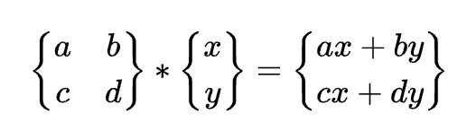
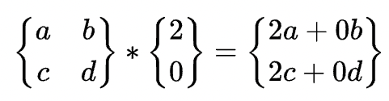
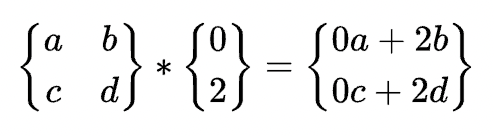
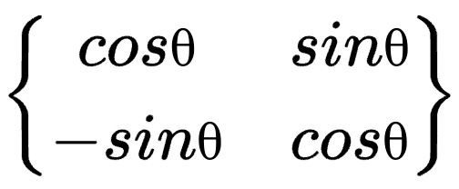
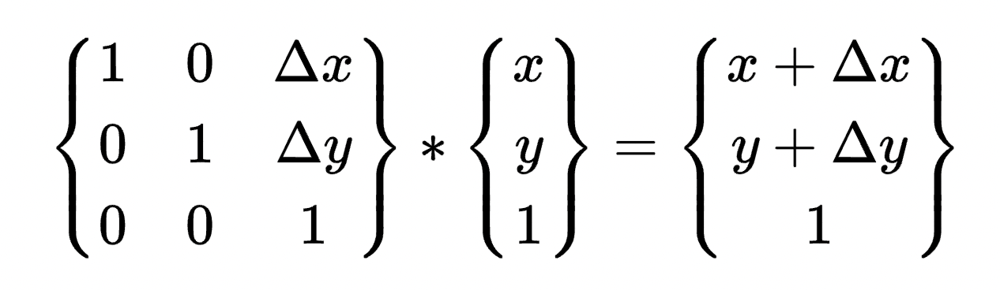

# 矩阵绘制工具

# https://www.latexlive.com/home

# 旋转矩阵的推演

## 如上图所示

### P (2,0) 绕圆点旋转 θ 角度,得到 P1(2\*cosθ,2\*sinθ)

### P3(0,2) 绕圆点旋转 θ 角度,得到 P4(2\*cosθ,-2\*sinθ)

## 基于矩阵的计算公式

## 基于 P(2,0) 绕圆点旋转 θ 角度到 P1(2\*cosθ,2\*sinθ) 的过程

## 得出 a=cosθ,c=sinθ

## 基于 P3(0,2) 绕圆点旋转 θ 角度到 P4(-2\*sinθ,2\*cosθ) 的过程

## 得出 b=-sinθ,d=cosθ

## 综上得出旋转矩阵为

888

# 平移矩阵的推演

# 先平移后旋转 (矩阵变换操作从右边往左边看)

# 先旋转后平移 (矩阵变换操作从右边往左边看)

