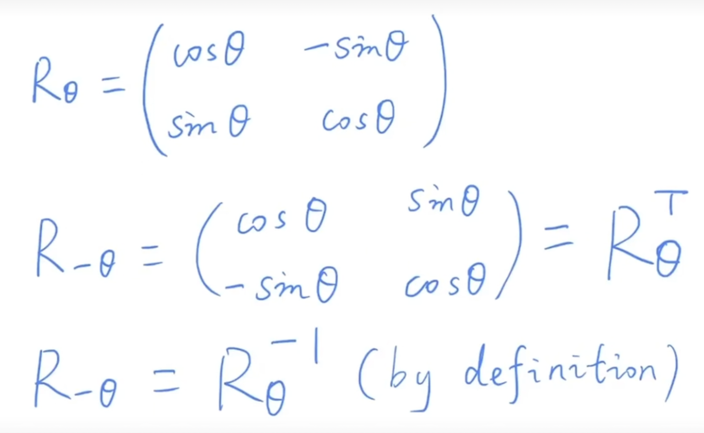

# 矩阵绘制工具

# https://www.latexlive.com/home

# 在线草图工具

# https://tilipa.zlsam.com/handdraw/

# 旋转矩阵的推演

## 如上图所示

### 1. P (1,0) 绕圆点旋转 θ 角度,得到 P1(cosθ,sinθ)

### 2. P2(0,1) 绕圆点旋转 θ 角度,得到 P3(-sinθ,cosθ)

### 基于矩阵的计算公式:

$\begin{Bmatrix}a&b\\c&d\end{Bmatrix}*\begin{Bmatrix}x\\y\end{Bmatrix}=\begin{Bmatrix}ax+by\\cx+dy\end{Bmatrix}$

### 基于 1 我们将 P(1,0) 带入公式

-   ## a+b\*0=cosθ => a=cosθ

-   ## c+d\*0=sinθ => c=sinθ

### 基于 2 我们将 P2(0,1) 带入公式

-   ## a\*0+b=-sinθ => b=-sinθ

-   ## c\*0+d=cosθ => d=cosθ

### 综上得出旋转矩阵为:(该旋转矩阵重点记忆,推导三维旋转矩阵的基础)

$\begin{Bmatrix}cosθ&-sinθ \\sinθ  &cosθ\end{Bmatrix}$

### 平移矩阵:
$\begin{Bmatrix} 1 & 0 &Δx \\ 0 & 1 &Δy  \\ 0 & 0  & 1\end{Bmatrix}* \begin{Bmatrix} x\\ y\\1\end{Bmatrix}=\begin{Bmatrix} x+Δx\\ y+Δy\\1\end{Bmatrix}$

### 先平移后旋转 (矩阵变换操作从右边往左边看)

$\begin{Bmatrix} cosθ &-sinθ  &0 \\ sinθ & cosθ & 0\\  0& 0 &1\end{Bmatrix}*\begin{Bmatrix} 1 & 0 &Δx \\ 0 & 1 &Δy  \\ 0 & 0  & 1\end{Bmatrix}=\begin{Bmatrix} cosθ &-sinθ  &cosθ*Δx- sinθ*Δx \\ sinθ & cosθ &sinθ*Δy+ cosθ*Δy \\  0& 0 &1\end{Bmatrix}$

### 先旋转后平移 (矩阵变换操作从右边往左边看)
 $\begin{Bmatrix} 1 & 0 &Δx \\ 0 & 1 &Δy  \\ 0 & 0  & 1\end{Bmatrix}* \begin{Bmatrix} cosθ &-sinθ  &0 \\ sinθ & cosθ & 0\\  0& 0 &1\end{Bmatrix}=\begin{Bmatrix} cosθ &-sinθ  &Δx \\ sinθ & cosθ &Δy \\  0& 0 &1\end{Bmatrix}$

