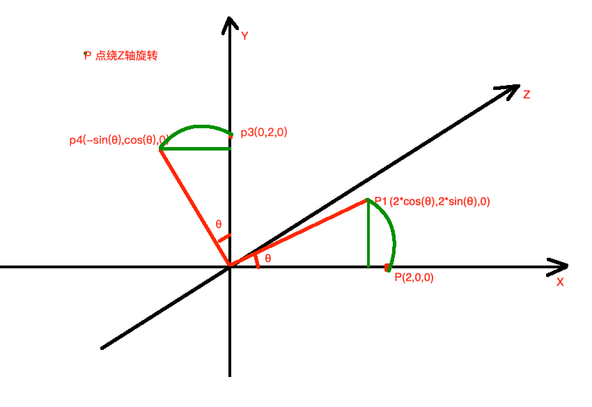
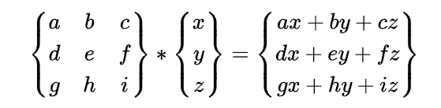
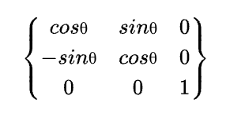

# 矩阵绘制工具

# https://www.latexlive.com/home

# 3D 旋转矩阵的推演

#

# 一 P(x,y,z)点绕 Z 轴旋转 θ 得到 P1(x1,y1,z1)

### 1. P (2,0,z) 绕 Z 轴旋转 θ 角度,得到 P1(2\*cos(θ),2\*sin(θ),z)

### 2. P3(0,2,z) 绕 Z 轴旋转 θ 角度,得到 P4(2\*cos(θ),-2\*sin(θ),z)

### 3. 由于点 P 是绕 Z 轴旋转得到的 P1 因此 z=z1

### 4. z 可以是任意值,我们在上图 P 和 P3 Z 为 0

# 基于矩阵计算公式

### 基于 1

-   2a+0y+zc=2cos(θ) => a=cos(θ) c=0
-   2d+0e+zf=2sin(θ) => d=sin(θ) f=0

### 基于 2

-   0a+2y+zc=-2sin(θ) => b=-sin(θ) c=0
-   0d+2e+zf=2cos(θ) => e=cos(θ) f=0

### 基于 3

-   gx+hy+iz=iz => g=h=0 i=1

### 综上我们可以得到绕 Z 轴的旋转矩阵是

#

# 一 P(x,y,z)点绕 Z 轴旋转 θ 得到 P1(x1,y1,z1)

### 1. P (2,0,z) 绕 Z 轴旋转 θ 角度,得到 P1(2\*cos(θ),2\*sin(θ),z)

### 2. P3(0,2,z) 绕 Z 轴旋转 θ 角度,得到 P4(2\*cos(θ),-2\*sin(θ),z)

### 3. 由于点 P 是绕 Z 轴旋转得到的 P1 因此 z=z1

### 4. z 可以是任意值,我们在上图 P 和 P3 Z 为 0

# 基于矩阵计算公式

### 基于 1

-   2a+0y+zc=2cos(θ) => a=cos(θ) c=0
-   2d+0e+zf=2sin(θ) => d=sin(θ) f=0

### 基于 2

-   0a+2y+zc=-2sin(θ) => b=-sin(θ) c=0
-   0d+2e+zf=2cos(θ) => e=cos(θ) f=0

### 基于 3

-   gx+hy+iz=iz => g=h=0 i=1

### 综上我们可以得到绕 Z 轴的旋转矩阵是

