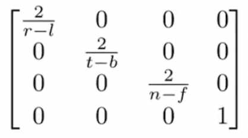
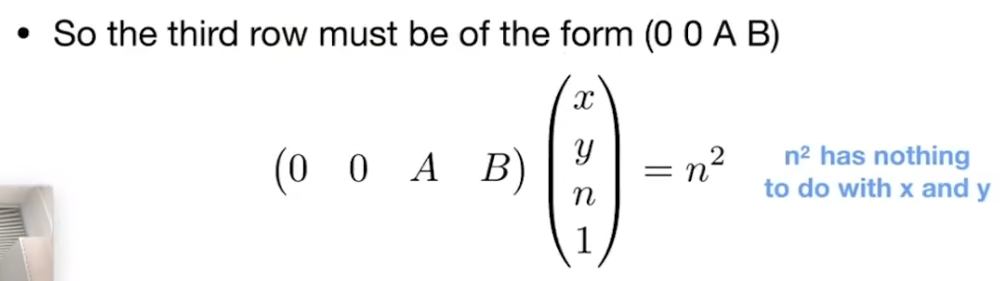

# 课堂笔记 Lecture 04
##  https://www.bilibili.com/video/BV1X7411F744/?p=4&vd_source=6c088aba3026664ecfbe1275f14ee53a

# 什么是MVP?
 - ## M 模型变化 操作模型的 旋转,平移,缩放等 使用仿射变化矩阵  
 - ## V 视图变化 将世界坐标模型变化到相机视图空间 使用以下推演的试图矩阵
 - ## P 投影变化 
 - ## 注意mvp都是对模型的操作,最终的目的是将三维空间中的模型,输出成一张二维的图片

# 以上矩阵如何推演?

- ## x轴:(1,0,0,0) Y轴:(0,1,0,0) Z轴:(0,0,1,0)

 $R_{\text {view }}^{-1}=\left[\begin{array}{cccc}x_{\hat{g} \times \hat{t}} & x_{t} & x_{-g} & 0 \\y_{\hat{g} \times \hat{t}} & y_{t} & y_{-g} & 0 \\z_{\hat{g} \times \hat{t}} & z_{t} & z_{-g} & 0 \\0 & 0 & 0 & 1\end{array}\right]$

## 对X轴进行旋转

 $\left[\begin{array}{cccc}x_{\hat{g} \times \hat{t}} & x_{t} & x_{-g} & 0 \\y_{\hat{g} \times \hat{t}} & y_{t} & y_{-g} & 0 \\z_{\hat{g} \times \hat{t}} & z_{t} & z_{-g} & 0 \\0 & 0 & 0 & 1\end{array}\right]*\begin{bmatrix} 1\\0 \\0\\0\end{bmatrix}=\left[\begin{array}{cccc}x_{\hat{g} \times \hat{t}}\\y_{\hat{g} \times \hat{t}}\\z_{\hat{g} \times \hat{t}}  \\0\end{array}\right]$

## 对Y轴进行旋转
 $\left[\begin{array}{cccc}x_{\hat{g} \times \hat{t}} & x_{t} & x_{-g} & 0 \\y_{\hat{g} \times \hat{t}} & y_{t} & y_{-g} & 0 \\z_{\hat{g} \times \hat{t}} & z_{t} & z_{-g} & 0 \\0 & 0 & 0 & 1\end{array}\right]*\begin{bmatrix} 0\\1 \\0\\0\end{bmatrix}=\left[\begin{array}{cccc}x_{t}\\y_{t}\\z_{t}  \\0\end{array}\right]$

## 对Z轴进行旋转
 $\left[\begin{array}{cccc}x_{\hat{g} \times \hat{t}} & x_{t} & x_{-g} & 0 \\y_{\hat{g} \times \hat{t}} & y_{t} & y_{-g} & 0 \\z_{\hat{g} \times \hat{t}} & z_{t} & z_{-g} & 0 \\0 & 0 & 0 & 1\end{array}\right]*\begin{bmatrix} 0\\0 \\1\\0\end{bmatrix}=\left[\begin{array}{cccc}x_{-g}\\y_{-g}\\z_{-g}  \\0\end{array}\right]$

# 正交投影矩阵如何推演?
- ### 物体边界中的长方体中心P((r+l)/2,(t+b)/2,(n+f)/2,1) 将其往原点平移,非常容易得出平移矩阵T 

- ### 物体边界中的长方体的 x= (r-l)/2 , y = (t-b)/2, z=(n-f)/2,要将其缩放成 x=1,y=1,z=1,因此非常容易得出缩放矩阵
  

# 透视矩阵

- ## 首先将透视视锥体Frustum->转换(Squish)长方体Cuboid

- ## 视椎体内任意一点(x,y,z) 连接相机和近平面必定有个相交的点 (x',y',z')
- ## 特性1: 由相似三角形得到 y'=n/z*y

- ## 同理 x'=n/z*x
- ## 因此我们能够得到一下的转换关系

- ## 上图矩阵如何推演? 

- ## 特性2:  根据任意在近平面上的点的 Z值不会改变的特性

- ## 为啥是(0,0,A,B)是如何推导的?
- ## 因为x,y取任意值,不会影响z=n*n 因此矩阵的第三行的前两个数据只能为0  
- ## 下面我们就关心的是 a*n+b=n\*n

- ## 特性3:  根据任意在远平面上的点的 Z值不会改变的特性

- ## 根据上图两个公式我们终于能够求出 A=n+f B=-nf
  

