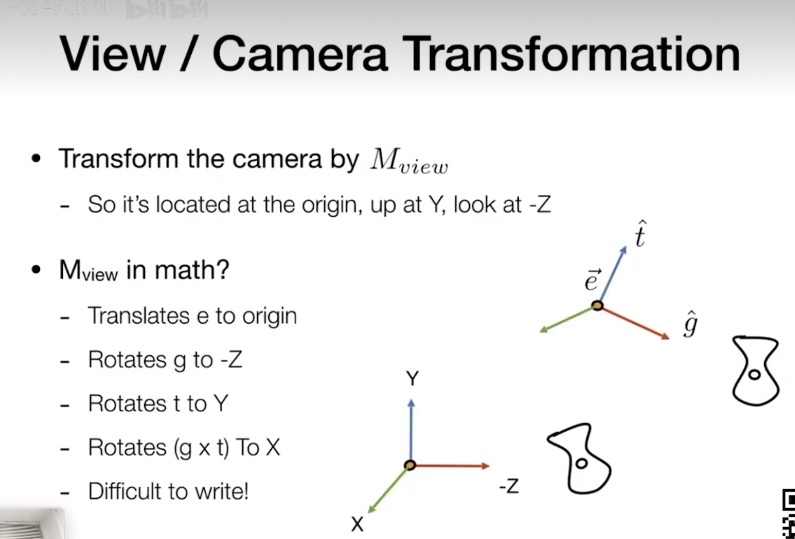
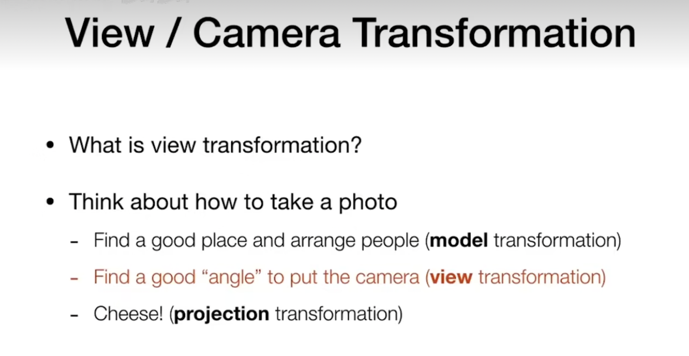

# 矩阵绘制工具

# https://www.latexlive.com/home

# 在线草图工具

# https://tilipa.zlsam.com/handdraw/

# 3D 旋转矩阵的推演 基于 Unity 左手坐标系

#

# 一 . P(x,y,z)点绕 Z 轴旋转 θ 得到 P1(x1,y1,z1)

### 1. P (1,0,z) 绕 Z 轴旋转 θ 角度,得到 P1(cosθ,sinθ,z)

### 2. P2(0,1,z) 绕 Z 轴旋转 θ 角度,得到 P3(-sinθ,cosθ,z)

# 基于矩阵计算公式

### 基于 1 我们将 P(1,0,z) 带入公式

-   ## a+0\*b+zc=cosθ => a=cosθ,c=0

-   ## d+0\*e+zf=sinθ => d=sinθ,f=0

-   ## g+0\*h+zi=z => g+zi=z

### 基于 2 我们将 P2(0,1,z) 带入公式

-   ## 0\*a+b+zc=-sinθ => b=-sinθ,c=0

-   ## 0\*d+e+zf=cosθ => e=cosθ,f=0

-   ## 0\*g+h+zi=z => h+zi=z

### 基于 g+zi=z h+zi=z

-   ## g=0,h=0,i=1

### 综上我们可以得到绕 Z 轴的旋转矩阵是

#

#

# 二. P(x,y,z)点绕 Y 轴旋转 θ 得到 P'(x1,y1,z1)

### 1. P (1,y,0) 绕 Y 轴旋转 θ 角度,得到 P1(cos(θ),y,sin(θ))

### 2. P2(0,y,1) 绕 Y 轴旋转 θ 角度,得到 P3(-sin(θ),y,cos(θ))

# 基于矩阵计算公式

### 基于 1 我们将 P(1,y,0) 带入公式

-   ## a+by+c\*0=cosθ => a=cosθ,b=0

-   ## d+ey+z\*0= y => d+ey=y

-   ## g+hy+i\*0=sinθ => g=sinθ,e=0

### 基于 2 我们将 P2(0,y,1) 带入公式

-   ## 0\*a+by+c=-sinθ => c=-sinθ,c=0

-   ## 0\*d+ey+f= y => ey+f=y

-   ## 0\*g+hy+i=cosθ => h=0,i=cosθ

### 基于 d+ey=y ey+f=y

-   ## d=0,e=1,f=0

### 综上我们可以得到绕 Y 轴的旋转矩阵是

#

#

# 三. P(x,y,z)点绕 Y 轴旋转 θ 得到 P'(x1,y1,z1)

### 1. P (x,1,0) 绕 Y 轴旋转 θ 角度,得到 P1(x,cos(θ),sin(θ))

### 2. P2(x,0,1) 绕 Y 轴旋转 θ 角度,得到 P3(x,-sin(θ),cos(θ))

# 基于矩阵计算公式

### 基于 1 我们将 P(x,1,0) 带入公式

-   ## ax+b+c\*0= x => ax+b=x

-   ## dx+e+z\*0= cosθ => d=0,e=cosθ

-   ## gx+h+i\*0= sinθ => g=0,h=sinθ

### 基于 2 我们将 P2(x,0,1) 带入公式

-   ## ax+b\*0+c=x => ax+c=x

-   ## dx+e\*0+f=-sinθ => d=0,f=-sinθ

-   ## gx+h\*0+i=cosθ => g=0,i=cosθ

### 基于 ax+b=x ax+c=x

-   ## a=1,b=0,c=0

### 综上我们可以得到绕 Z 轴的旋转矩阵是

